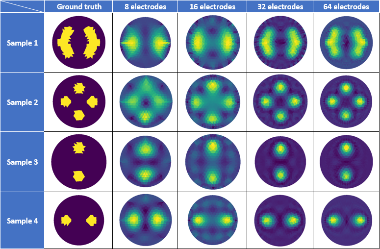

# DeepEIT

## Overview
DeepEIT is a deep learning model capable of solving the EIT reconstruction based on the neighbours' measurements method.
The goal is to demonstrate the capabilities of a simple deep learning model to solve an ill-posed problem in a short 
amount of time with minimum training time.
I am using the [pyEIT](https://github.com/liubenyuan/pyEIT) for data generation and reference.

## Computation time comparison between algorithms and deep learning

The algorithms' computation time is growing exponentially with the number of parameters (measurements).

Deep learning seems to not be affected by the number of parameters. It is a important part since we want to reduce the computation time.

## Accuracy comparison between algorithms and deep learning

The Gauss-Newtonian reconstruction algorithm is getting increasingly more accurate with the growing number of parameters, but inducing noise as well.

The deep learning model is inaccurate with a number of electrodes lower than 16. It can achieve the same accuracy as with a higher number of electrodes.

## Model's design

The reconstructor is simple in design and efficient enough to be used alone. It makes it perfect for a use case on an edge device.

The autoencoder can reduce the noise and outline better the anomalies, but requires higher computation capabilities. It could be used on 
powerful edge devices (e.g.: smartphones), or on a computer. It should be used paired with the reconstructor, as it is not designed to reconstruct the image alone.

